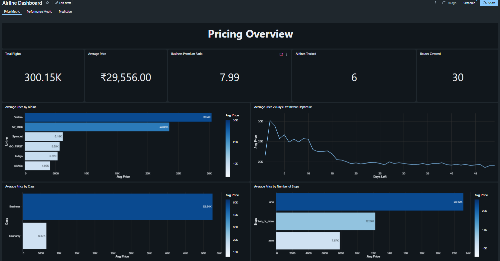
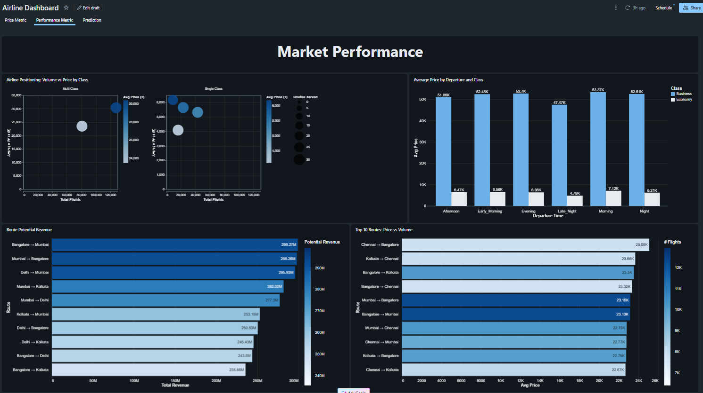
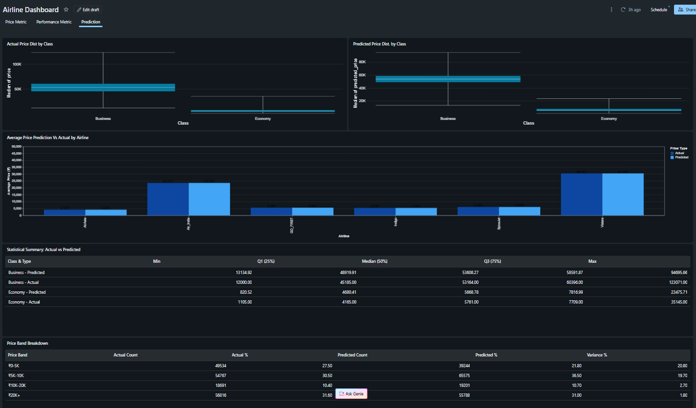

# Airline Dashboard 📊

The Airline RAG System includes an interactive **AI/BI Lakeview Dashboard** with 3 pages:

## 📈 Dashboard Pages

### 1. **Price Metrics**
* Total flights tracked
* Average flight prices
* Business vs Economy premium ratio
* Price by airline, class, and stops
* Price trends vs days before departure
  


### 2. **Performance Metrics**
* Top 10 routes by revenue potential
* Top 10 routes by price vs volume
* Airline positioning (volume vs price by class)
* Time-of-day pricing analysis



### 3. **Predictions**
* ML price predictions vs actual prices
* Price band distribution (₹0-5K, ₹5K-10K, ₹10K-20K, ₹20K+)
* Statistical summary (quartiles, median)
* Price distribution by class (box plots)



---

## 🔗 Access Options

### **Make Dashboard Public** 

1. **Open the dashboard in Databricks:**
   **User acc. required**
   ```
   https://dbc-25119fb3-3329.cloud.databricks.com/dashboardsv3/01f1978c33611adaa8a000284459bbf7/published?o=7474658491942202
   ```
   
---


## 🔗 Links

* **Live Dashboard**: [Airline Dashboard](#dashboard-2497054289407567)
* **Data Setup**: See `setup_data.py`
* **RAG System**: See `rag_system.py`
* **GitHub Repo**: [airline-rag-system](https://github.com/JeanAndre376/airline-rag-system)
